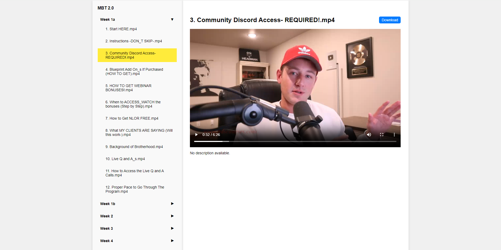

# 🎥 VidExplore: Your Dynamic Video Library

Welcome to **VidExplore**, a sophisticated and user-friendly video viewer that dynamically scans your directories for video files and their corresponding descriptions. Inspired by the seamless interfaces of platforms like Skool and Udemy, VidExplore offers an intuitive way to organize and view your video content.



## Features

- 📂 **Automatic Directory Scanning**: VidExplore scans folders in the same directory, identifying video files and their corresponding text files for descriptions.
- ▶️ **Dynamic Video Player**: Easily navigate through videos with a sleek player that supports descriptions and download options.
- ⬇️ **Download Button**: Download your videos directly from the player.
- 📱 **Responsive Design**: Fully responsive layout ensuring optimal viewing experience on any device.
- 🖥️ **User-Friendly Interface**: Simple and elegant UI that makes browsing and watching videos a breeze.

## Getting Started

### Prerequisites

- A web server with PHP support.
- Basic understanding of HTML, CSS, and JavaScript.

### Installation

1. **Clone the repository:**
   ```sh
   git clone https://github.com/BoranCanOzel/VidExplore-Your-Dynamic-Video-Library.git
   cd VidExplore-Your-Dynamic-Video-Library

   ```

2. **Set up your environment:**
   - Ensure your server can execute PHP scripts.
   - Place your video files and corresponding text files in appropriate directories.

3. **Start your local server:**
   - If you have a local server setup like XAMPP or WAMP, place the project in the `htdocs` or `www` directory.
   - Alternatively, use the provided `start.bat` file to launch a simple PHP server (Windows only). You can run it on your PC and access the videos on your phone as well.

4. **Access VidExplore:**
   Open your browser and navigate to `http://localhost/path-to-your-project`.

### Usage

- **Adding Videos:**
  - Place your video files in the respective folders.
  - Ensure there is a `.txt` file with the same name as the video file to serve as its description.

- **Navigating the Interface:**
  - The sidebar displays the list of folders.
  - Click on a folder to reveal the videos.
  - Select a video to play it and view its description.

### Files

- `index.html`: The main HTML file containing the structure of the web page.
- `style.css`: The CSS file for styling the web page.
- `script.js`: The JavaScript file for handling the dynamic behavior of the web page.
- `getVideosInFolder.php`: PHP script to fetch videos in a folder.
- `whatfoldersarehere.php`: PHP script to fetch the list of folders.
- `start.bat`: Batch file to start a PHP server (Windows only).

### Contributing

Contributions are welcome! Please fork the repository and create a pull request with your changes. Ensure your code follows the existing style and conventions.

### License

This project is licensed under the MIT License. See the [LICENSE](LICENSE) file for more details.

### Acknowledgements

- Inspired by educational platforms like Skool and Udemy.
---

Enjoy using VidExplore and happy viewing! 🎉
